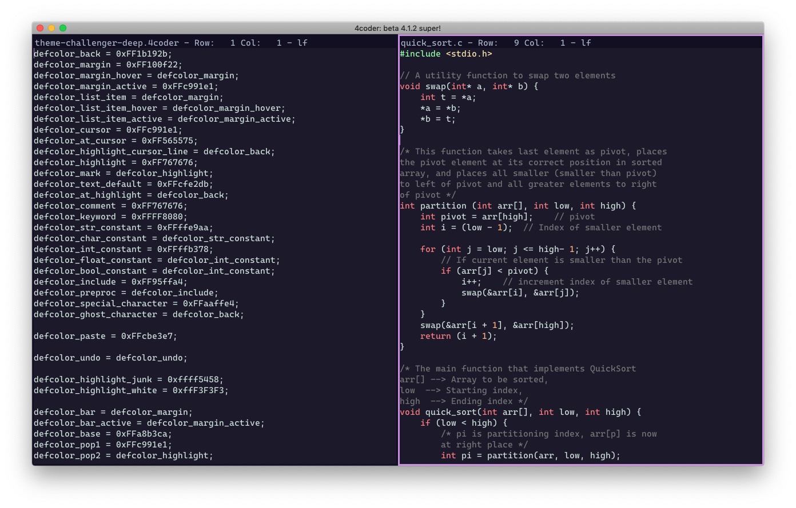
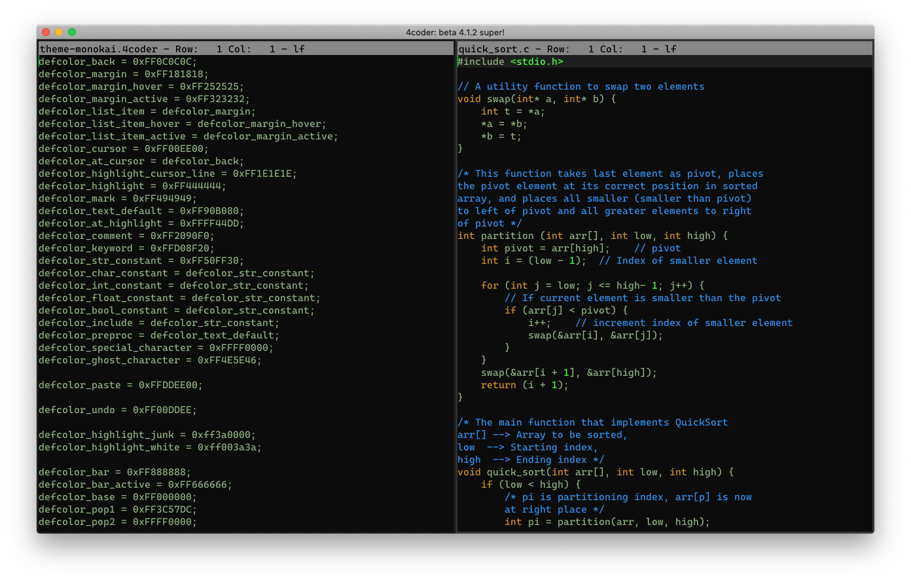
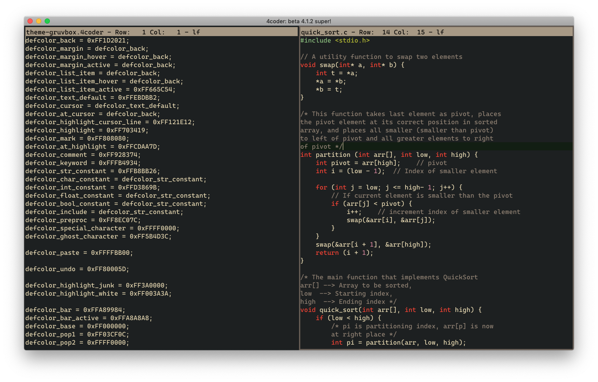

# 4custom
4coder Themes and Customisation. by IamRifki et al.

## Themes

> NOTE: Themes are under CC0

### Strawberry

4coder port of the [strawberry vim theme](https://github.com/nightsense/strawberry).

### Witness

Updated version of https://github.com/jamessral/4coder-witness-theme.

### Challenger Deep

Theme based on [challenger-deep](https://github.com/challenger-deep-theme/).

### Monokai

### Gruvbox

## Custom layer
### TODO